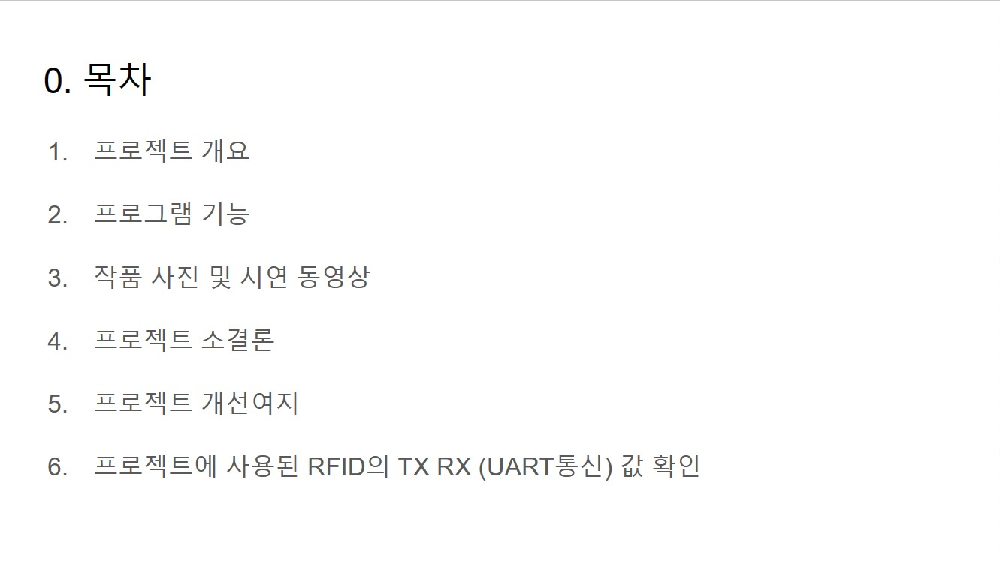

객체지향 프로그래밍 프로젝트: MFC로 재고조회 프로그램 만들기
==========
## 프로젝트 설명
프로젝트 수행자: intel Edge AI SW 개발자 아카데미 (3기_권강현) 
 
프로젝트 수행기간: 23/10/25 ~ 23/11/01 
 
프로젝트 개발환경: 
- Windows 10 
- Microsoft Visual Studio Community 2022 (64-bit) - Current 버전 17.7.5 
- MFC앱(C++,Windows,Desktop) 프로젝트 템플릿
 
 

## 프로젝트 발표 자료
(아래 이미지를 클릭하시면 구글 슬라이드로 이동합니다.) 
 
 
 

<!-- 

## 프로젝트 시연 영상
(아래 이미지를 클릭하시면 유튜브로 이동합니다.) 
 
 

## 프로젝트 발표 영상
(아래 이미지를 클릭하시면 유튜브로 이동합니다.) 
 
 

 -->